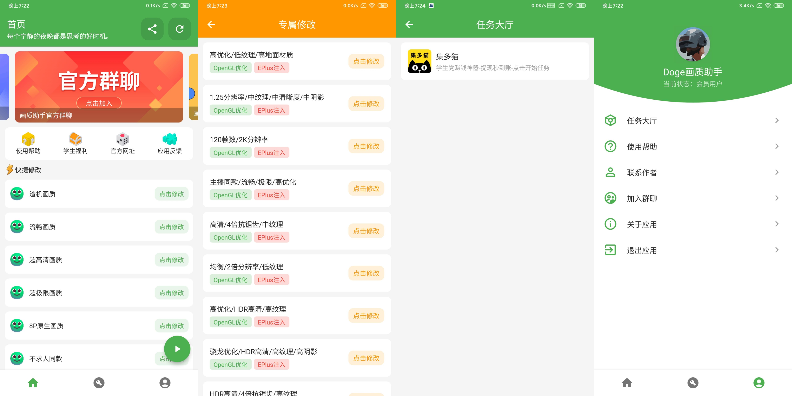

# Doge画质助手
专门给和平精英修改画质的应用，学习Flutter随便开发的，仅支持安卓版本，没什么技术含量 :)

## 应用功能
* 一些简单的画质修改
* 完成特定任务即可使用
* 还有花里胡哨没用的功能
* 支持安卓13设备画质修改

## 应用截图

## 开发时的环境
    Flutter (Channel stable, 3.7.12, on Microsoft Windows [版本 10.0.19045.2965], locale zh-CN)
    • Flutter version 3.7.12 on channel stable at D:\SDK\flutter
    • Upstream repository https://github.com/flutter/flutter.git
    • Framework revision 4d9e56e694 (6 weeks ago), 2023-04-17 21:47:46 -0400
    • Engine revision 1a65d409c7
    • Dart version 2.19.6
    • DevTools version 2.20.1
    • Pub download mirror https://pub.flutter-io.cn
    • Flutter download mirror https://storage.flutter-io.cn

## 其他
成品下载地址 [Releases](https://github.com/shinexoh/dogehzzs/releases)

需要的功能基本完成了，以后应该也不会更新新功能了，有问题请发 [Issues](https://github.com/shinexoh/dogehzzs/issues)
